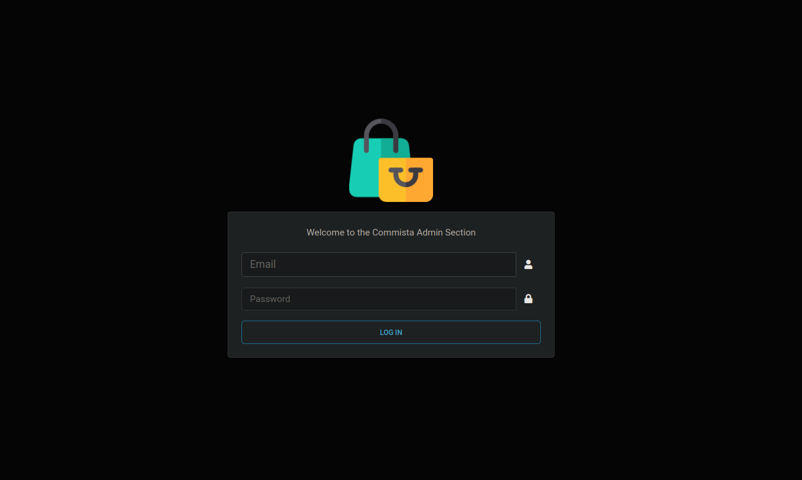

# Commista E-Commerce API



Commista is a versatile commerce API designed to facilitate seamless online shopping experiences. With Commista,
administrators have full control over product management, including the ability to add new products, create attractive
offers, and organize items into categories. Additionally, administrators can easily notify customers about promotions,
updates, and other important information. Customers can explore the diverse range of products, conveniently add items to
their cart, and enjoy a hassle-free checkout process with secure payment options. Commista empowers businesses to
deliver a comprehensive and engaging e-commerce platform to their customers.

## Commista Postman Documentation

https://bit.ly/43R3adH

## Technologies used

- Python
- Django, Django Rest Framework
- SQLite3, MariaDB
- Docker and Docker-Compose
- Pytest (unit testing)
- CircleCI (CI/CD)

## Getting Started

To get the service up and running, follow the steps below:

1) Clone the project by using the command below in your terminal
    ```
    https://github.com/S13G/Commista.git
    ```
2) Change directory into the cloned repository
    ```
    cd Commista
    ```
3) Rename the ``.env.template`` to ``.env`` and update the values.

4) Build and run the service with
   ```
   docker-compose up --build
   ```
   or execute the command below in case permission is denied and root user/permission is needed
   ```
   sudo docker-compose up --build
   ```
   The service will build and run on port ``8000``
5) Launch a new terminal session and run the following commands
   ```
   python manage.py makemigrations
   ```
   The command above runs the migrations if there are some unapplied migrations
   ```
   python manage.py migrate
   ```
   The command above performs the database migrations
6) Create an admin user with the command below:
   ```
   python manage.py createsuperuser
   ```
   After creating the superuser, access the admin panel and login with your admin credentials with the
   link https://localhost:8000/api/v1/admin/

### Admin Login Screen


### Admin Dashboard Screens

#### Light Mode


#### Dark Mode

